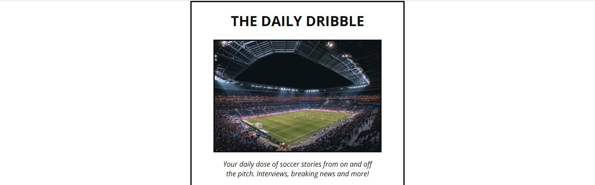

# The Daily Dribble Newsletter

A clean and stylish, single-page newsletter signup form with a soccer theme. This project is a front-end component designed to capture user emails for a newsletter subscription. It is built with pure HTML and CSS, focusing on a simple, centered layout and a bold, minimalist design.

## Preview

 

A live demo can be viewed [here](https://herveinp.github.io/the-daily-dribble-newsletter-project/).

## Features

-   **Clean & Modern Design:** A simple, visually appealing layout centered on the page.
-   **Responsive Elements:** The layout uses Flexbox for easy alignment.
-   **Custom Fonts:** Utilizes the "Open Sans" font from Google Fonts for better typography.
-   **Clear Call-to-Action:** A prominent form with an email input and a "JOIN NOW" button to encourage user sign-ups.
-   **Static Page:** Built entirely with HTML and CSS, making it lightweight and easy to deploy.

## Technologies Used

-   **HTML5:** For the structure and content of the web page.
-   **CSS3:** For styling, layout (Flexbox), and design.
-   **Google Fonts:** For importing and using the "Open Sans" web font.

## Getting Started

To get a local copy up and running, follow these simple steps.

### Prerequisites

You only need a modern web browser (like Chrome, Firefox, or Safari).

### Installation

1.  Clone the repository to your local machine:
    ```sh
    git clone https://github.com/herveinp/the-daily-dribble-newsletter-project.git
    ```
2.  Navigate to the project directory:
    ```sh
    cd the-daily-dribble-newsletter-project
    ```
3.  Open the `index.html` file in your web browser.

That's it! You should now see the newsletter form on your screen.

## Project Structure

The project follows a simple and straightforward file structure:

```
.
├── index.html         // The main HTML file
├── style.css          // The CSS stylesheet
└── images/
    └── stadium.jpg    // The background image for the newsletter
```

## Code Snippets

### HTML Structure

The core of the project is a single container that holds all the elements, styled with the `.newsletter-container` class.

```html
<div class="newsletter-container">
    <h1>THE DAILY DRIBBLE</h1>
    
    <p class="newsletter-paragraph">
        Your daily dose of soccer stories from on and off the pitch.
    </p>
    <form action="#" method="post" class="newsletter-form">
        <input type="email" name="email" class="newsletter-input" placeholder="ENTER YOUR EMAIL" />
        <button type="submit" class="newsletter-button">JOIN NOW</button>
    </form>
    <p class="newsletter-paragraph" id="newsletter-second-paragraph">
        Read our <a href="https://scrimba.com/" target="_blank">terms of service.</a>
    </p>
</div>
```

### CSS Styling

The layout is achieved using Flexbox to center the content both vertically and horizontally within the main container.

```css
.newsletter-container {
  display: flex;
  flex-direction: column;
  justify-content: center;
  align-items: center;
  margin: 0 auto;
  border: 3px solid #121212;
  width: 386px;
  text-align: center;
}
```

## Credits

-   **Image:** The beautiful stadium photo was provided by [Thomas Serer](https://unsplash.com/@jesusance) on [Unsplash](https://unsplash.com/).
-   **Concept:** This project appears to be inspired by a tutorial or challenge, as indicated by the "terms of service" link to [Scrimba](https://scrimba.com/).

## License

This project is open-source and available under the [MIT License](LICENSE).